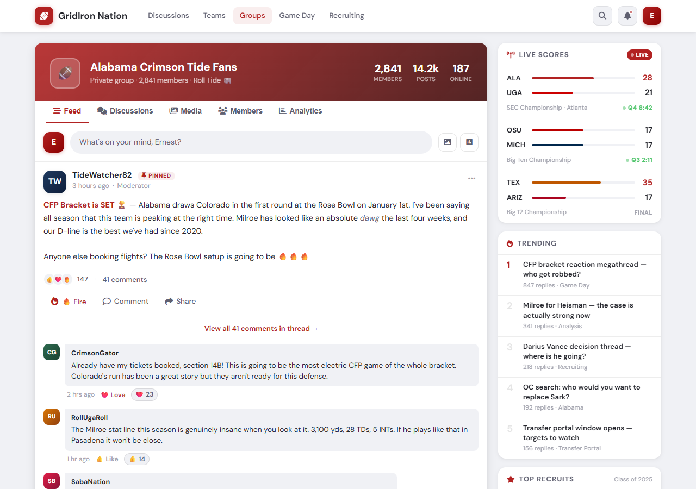
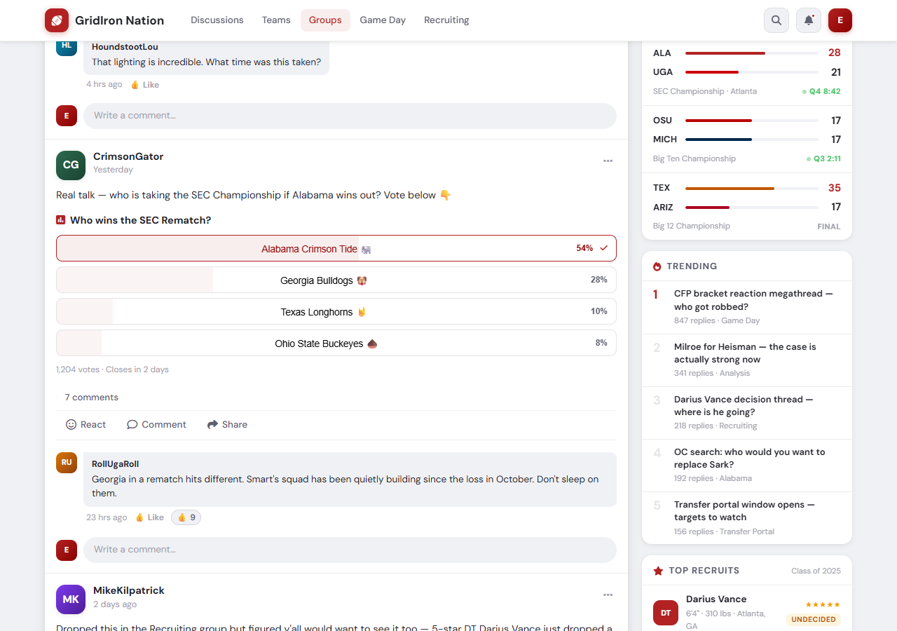
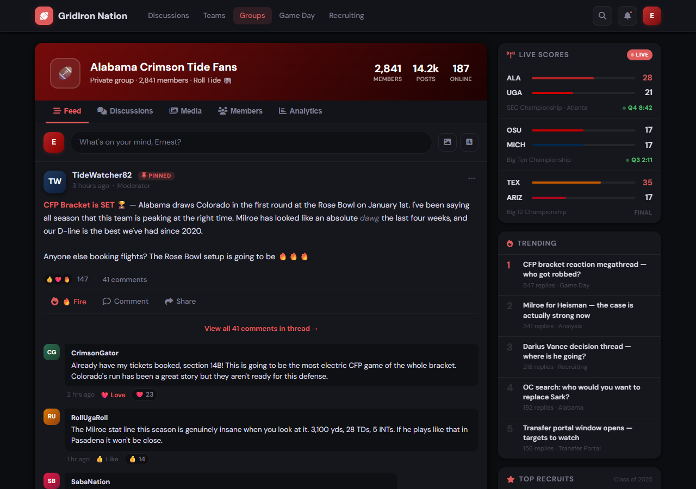
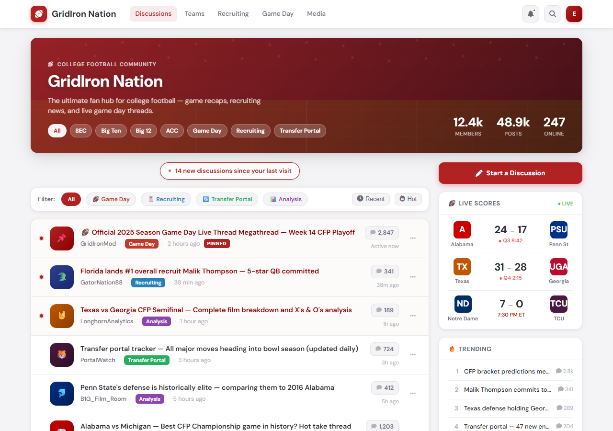

# GridIron Nation 🏈

**A Flarum 2 theme for college football fan forums.**  
Crimson & DM Sans, Avocado-style organic radius, real-time live scores, trending discussions, top recruit tracker, and full dark mode.

---

## Screenshots

### Forum Index — Light Mode


### Group Feed — Light Mode


### Polls & Reactions


### Group Feed — Dark Mode


### Forum Index — Dark Mode


---

## Features

### 🎨 Design System
- **Crimson primary** (`#B22222`) — instantly recognisable college football colour
- **DM Sans Variable** — loaded from Google Fonts, replaces Flarum's default font throughout
- **14 px organic border-radius** — Avocado-inspired, applied to cards, dropdowns, modals, buttons, and inputs
- **Layered surface depth** — `#f0f1f5` page → `#fff` cards → `#f8f8fa` inset, mirrored in dark mode (`#0c0d10` → `#16171c` → `#0f1013`)
- **CSS custom property overrides** — works alongside any other Flarum 2 theme that respects `--primary-color`, `--body-bg`, etc.

### 🌙 Dark Mode
- Full `prefers-color-scheme: dark` support
- Surfaces shift from near-black `#0c0d10` through `#16171c` cards to `#0f1013` inset areas (inputs, poll options, comment bubbles)
- Primary colour shifts to `#e05c5c` for legibility on dark backgrounds
- Dark mode CSS block placed **last in the stylesheet** — correct cascade, no specificity fights

### 📺 Live Scores Widget
- Proxies ESPN's public college football scoreboard API — no API key required
- Displays up to 6 games sorted: **Live → Scheduled → Final**
- Pulsing green **LIVE** badge with quarter and clock detail
- Winning score highlighted in crimson
- Auto-refreshes every **60 seconds** while the page is open
- Graceful fallback — shows "Scores unavailable" if ESPN times out

### 🔥 Trending Widget
- Pulls the 5 most recently active discussions straight from Flarum's own API
- Rank numbers 1–2 shown in crimson, rest in muted grey
- Displays reply count and relative time
- Refreshes every **5 minutes**

### 👥 Online Now Widget
- Lists members seen in the last 5 minutes (`last_seen_at`)
- Avatar with green presence dot, falls back to initial monogram
- Member count shown in the widget header
- Refreshes every **2 minutes**

### ⭐ Top Recruits Widget
- Manual admin entry — no third-party API licence required
- Per-recruit fields: **Name · Position · Height · Hometown · Stars (1–5) · Commit status · School · Sort order**
- Three commit states with colour-coded pills:
  - 🟢 **Committed** — school name shown
  - 🟡 **Undecided**
  - 🔴 **Decommitted**
- Crimson position badge (QB, WR, DT …)
- Amber star rating (★★★★☆)
- Refreshes every **10 minutes**

### 🛠 Admin Recruits Manager
- Full CRUD interface registered as the extension's admin settings page
- 2-column form grid — add or edit recruits in place
- Sortable via `sort_order` field
- Inline edit / delete with confirmation

---

## Installation

### Via Composer
```bash
composer require ernestdefoe/gridiron-nation
php flarum migrate
php flarum cache:clear
```

### Manual
1. Download or clone this repo into `extensions/ernestdefoe-gridiron-nation/`
2. Run `composer install` in the Flarum root
3. Run `php flarum migrate`
4. Run `php flarum cache:clear`
5. Enable **GridIron Nation** in the Flarum admin panel

> **JS is pre-compiled.** `js/dist/forum.js` and `js/dist/admin.js` are committed — no local build step needed.

---

## Requirements

| Dependency | Version |
|---|---|
| PHP | `^8.3` |
| Flarum | `^2.0` |
| flarum/core | `^2.0` |

---

## Building JS from source

```bash
cd js
npm install
npm run build   # production
npm run dev     # watch mode
```

---

## Sidebar Widgets

All four widgets are injected into `IndexPage.prototype.sidebarItems` at priorities 80–110, so they appear above the default tag navigation. Each widget is a self-contained Mithril component that manages its own fetch lifecycle and cleanup.

| Widget | Priority | Refresh |
|---|---|---|
| Live Scores | 110 | 60 s |
| Trending | 100 | 5 min |
| Top Recruits | 90 | 10 min |
| Online Now | 80 | 2 min |

---

## API Endpoints

| Method | Path | Description |
|---|---|---|
| `GET` | `/api/gn-live-scores` | ESPN scoreboard proxy (public) |
| `GET` | `/api/gn-online` | Users online in last 5 min (public) |
| `GET` | `/api/gn-recruits` | List recruits (public) |
| `POST` | `/api/gn-recruits` | Create recruit (admin only) |
| `PATCH` | `/api/gn-recruits/{id}` | Update recruit (admin only) |
| `DELETE` | `/api/gn-recruits/{id}` | Delete recruit (admin only) |

---

## License

MIT © [ernestdefoe](https://github.com/ernestdefoe)
